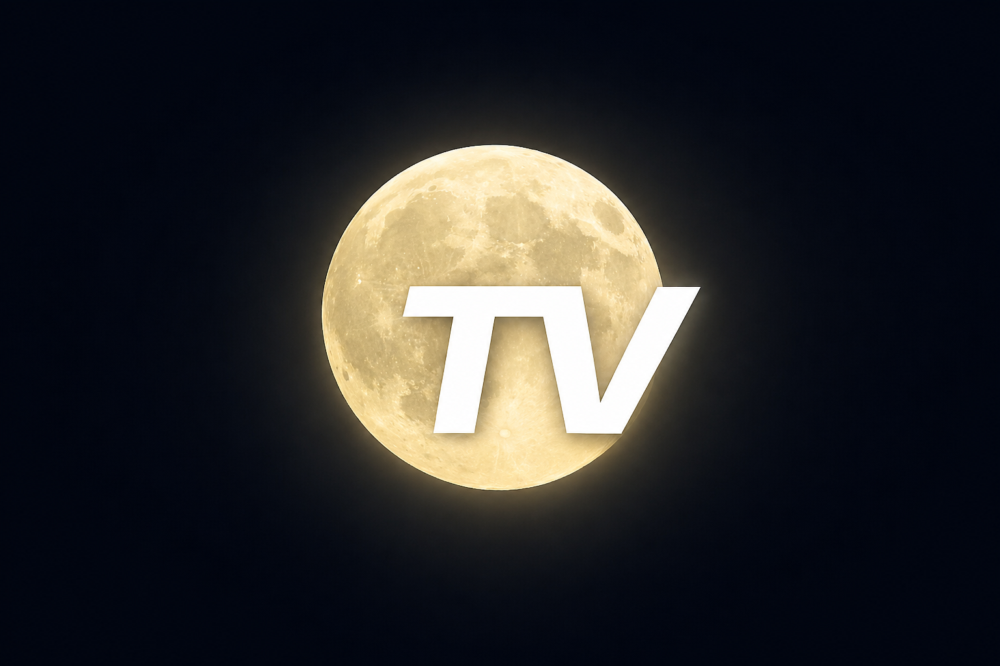

<p align="center">
  
</p>

<h1 align="center">MoonTV</h1>

<p align="center">
Modern TVHeadend frontend inspired by webOS<br>
built with FastAPI.
</p># MoonTV

---

## Features

- 📺 Live TV (TVHeadend)
- 📖 Interactive TV Guide (EPG)
- 📡 TVHeadend Channel API
- 🖥 Modern webOS-inspired interface
- ⌨ Keyboard navigation
- 🖱 Mouse navigation
- 📺 On Screen Display (OSD)
- ℹ Channel Information
- 🖼 Channel Logos
- ⚡ FastAPI backend
- 🎨 Responsive UI

---

## Screenshots

Coming soon

---

## Requirements

- Python 3.11+
- FastAPI
- TVHeadend 4.3+
- Modern Browser

---

## Installation

```bash
git clone ...
cd moontv

python -m venv .venv
source .venv/bin/activate

pip install -r requirements.txt

uvicorn app:app --reload
```

---

## Project Structure

See:

PROJECT_STRUCTURE.md

---

## Current Features

### Dashboard

- Status overview

### Live TV

- Live MPEG-TS playback
- Channel selection
- OSD
- Channel information

### TV Guide

- Timeline
- Current time indicator
- Program navigation
- Channel logos
- Detail view

---

## Roadmap

### v0.2.0

- TV Guide
- Branding
- README
- Logo
- Guide Navigation

### v0.3.0

- Favorites
- Search
- Recordings
- Settings

---


## Acknowledgements

MoonTV is developed by darosto.

Architecture discussions, code reviews, debugging assistance,
and implementation support were created in collaboration
with ChatGPT (OpenAI).